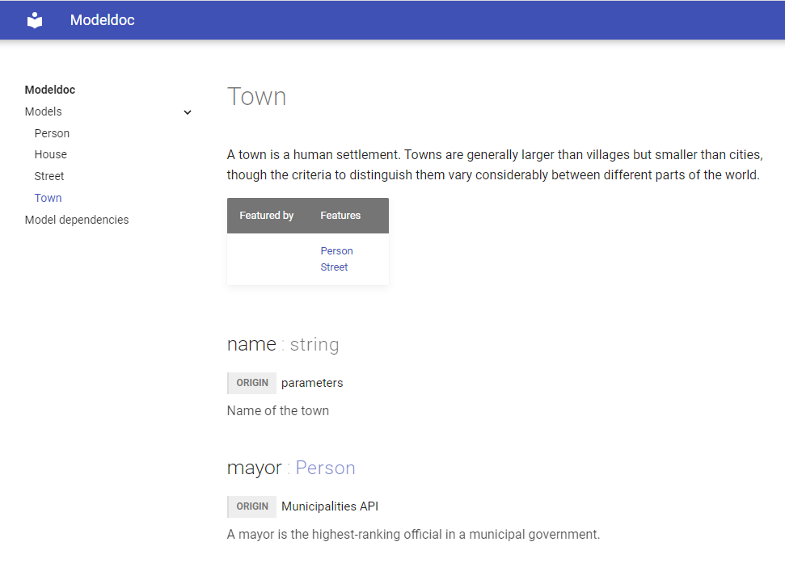

# Modeldoc

Modeldoc is a tool for creating mkdoc files from Python models. Specifically, it parses  classes (generally [dataclass](https://docs.python.org/3/library/dataclasses.html) or [Pydantic](https://pydantic-docs.helpmanual.io/usage/models/)) from Python files, outputting .md files designed for [Material for MkDocs](https://squidfunk.github.io/mkdocs-material/)

E.g.
```python
from typing import List

class Town():
    name: str
    mayor: Person
    state: str
    streets: List[Street]

'''
Town
Towns are generally larger than villages but smaller than cities, 
though the criteria to distinguish them vary considerably between different parts of the world.
'''

'''
mayor
origin -> Municipalities API
A mayor is the highest-ranking official in a municipal government.
'''

'''
name
origin -> parameters
Name of the town
'''
```

becomes

